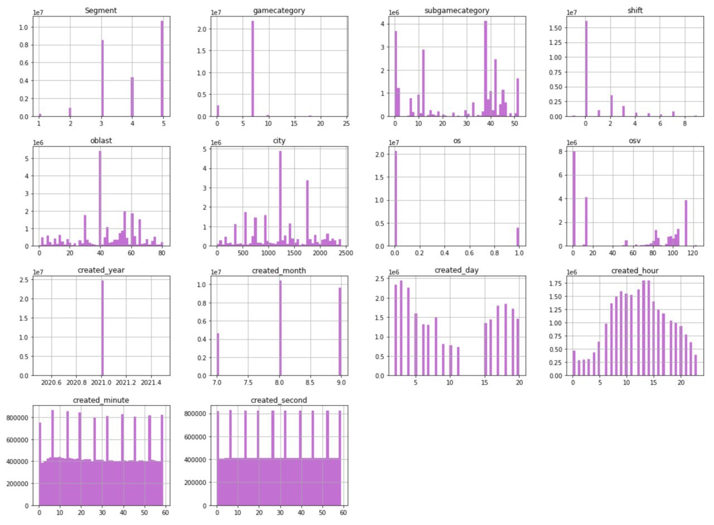
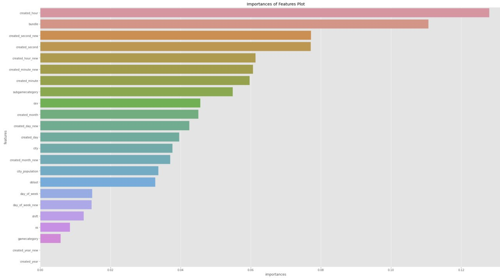

# hack_mobile


## Load submission

Csv table with predictions to test data.

```
/bin/bash  ./submission_load.sh
```

## Load train/test data

Csv table with predictions to test data.

```
/bin/bash  ./build.sh
```

## Project structure

- ``collect_data`` - сбор данных с AppStore
- ``data`` - директория с данными для обучения / и предпосчитами агрегационными данными
- ``ml`` - директория со всеми .ipynb для отработки полного мл пайплайна 
- ``data_vizual`` - отрисовка графиков 
- ``backend`` - API c интерактивными графиками 

## Usage
### Backend API with data visualization
- cd backend
- conda create -n hyper-adv python=3.7
- conda activate hyper-adv
- pip install -r requirements.txt
- python run.py
- open http://127.0.0.1:5000/ in browser

### Machine Learning
Pipeline:
1) EDA.ipynb - первичный анализ данных

2)FeatureImportance.ipynb - выявление главных фичей с помощью *RandomForest*

2) LearnModels.ipynb - дополнение данных и обучение моделей классического машинного обучения
3) ...repeat пункт (2)...
4) RunModels.ipynb - инференс моделей с подготовкой submissions файлов